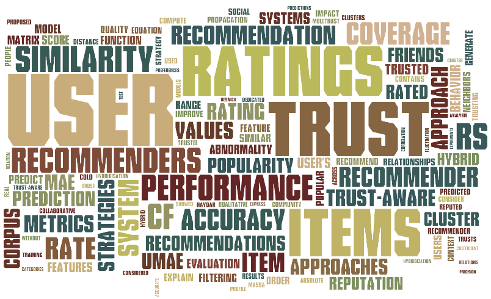

# Recommender Systems Lab

# Contents

Here are the essay version of my notes from various Recommender System, lectures, books, and research papers. All credits to the researchers. See
references below.

1. What is a Recommender System? [[Essay](http://nbviewer.ipython.org/github/jthang/RecSysLab/blob/master/intro.ipynb)]
- Collaborative Filtering [[Essay](http://nbviewer.ipython.org/github/jthang/RecSysLab/blob/master/cf.ipynb)]
- Matrix Factorization (SVD) [[Essay](http://nbviewer.ipython.org/github/jthang/RecSysLab/blob/master/svd.ipynb)]
- Introduction to Restricted Boltzmann Machines
- Content-based Recommendations
- Learning to Rank
- Context-aware Recommendations
- Similarity
- Social Recommendations
- Evaluating Recommender System
- What did we learn from Netflix Prize?

# Case Study
[back to top](#contents)

- A [[Essay]()]
- B [[Essay]()]
- c [[Essay]()]

# References
[back to top](#contents)
- [Restricted Boltzmann Machines for Collaborative Filtering - Geoffrey Hinton](http://www.cs.utoronto.ca/~hinton/absps/netflixICML.pdf)
- [A Practical Guide to Training Restricted Boltzmann Machines - Geoffrey Hinton](http://www.cs.toronto.edu/~hinton/absps/guideTR.pdf)
- [Recommender Systems - Xavier Amatriain](http://www.slideshare.net/xamat/recommender-systems-machine-learning-summer-school-2014-cmu)
- [Coursera Recommender Systems - Joseph A Konstan](https://www.coursera.org/course/recsys)
- [Try this at home - Simon Funk](http://sifter.org/~simon/journal/20061211.html)
